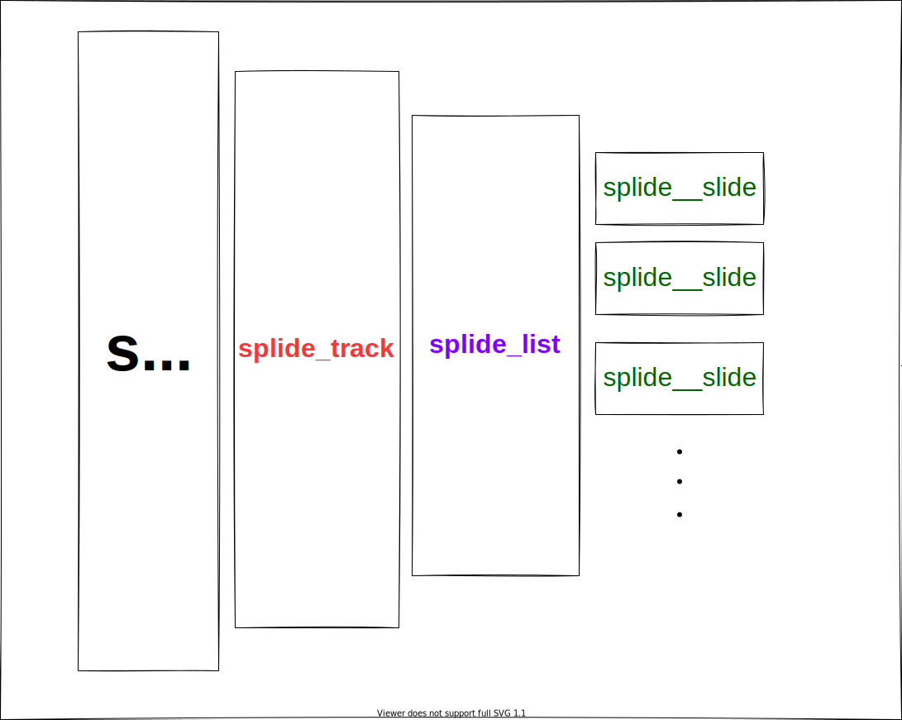

#### splide cdn
```js
<script src="https://cdn.jsdelivr.net/npm/@splidejs/splide@2.4.21/dist/js/splide.min.js"></script>
```

#### CDN link for styling
```html
<link
rel="stylesheet"  
href="https://cdn.jsdelivr.net/npm/@splidejs/splide@2.4.21/dist/css/splide.min.css"
/>
```

#### basic hierarchy



#### Then initialize and mount Splide after the DOM content is loaded.

```js
document.addEventListener( 'DOMContentLoaded', function () {
	new Splide( '#image-slider' ).mount();
} );
```

#### to adopt image size adjust css
```css
.splide__slide img {
	width : 100%;
	height: auto;
}
```

#### Auto Crop
using 'cover' option, images can be displayed in a same size
```js
document.addEventListener( 'DOMContentLoaded', function () {
	new Splide( '#image-slider', {
		'cover'      : true,
		'heightRatio': 0.5,
	} ).mount();
} );
```